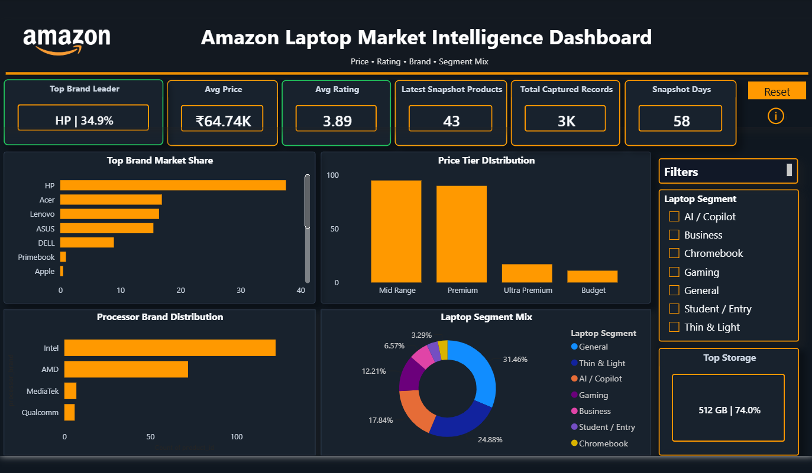
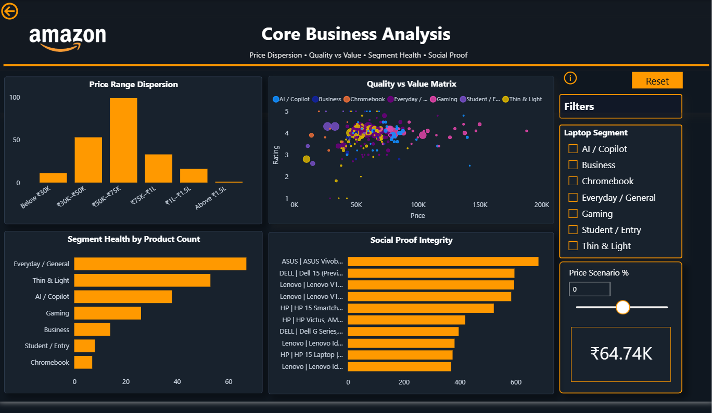

# Dashboard Screenshots

This folder contains screenshots of the Power BI dashboard developed for the Amazon Laptop Market Intelligence project.

The dashboard is organized into two analytical pages:

1. Executive Market Overview
2. Core Business Analysis

---

## Executive Market Overview

The Executive Market Overview provides a high-level view of the captured Amazon laptop market.

Key insights include:

- Top Brand Leader
- Average Price
- Average Rating
- Latest Snapshot Products
- Total Captured Records
- Snapshot Days
- Brand Market Share
- Price Tier Distribution
- Processor Brand Distribution
- Laptop Segment Mix
- Most Common Storage Capacity

The page also includes:

- Laptop Segment filtering
- Interactive KPI cards
- Dynamic conditional formatting
- Business Logic Dictionary

---

## Core Business Analysis

The Core Business Analysis page provides deeper analysis of product pricing, product segments, quality, value, and social proof.

Key analytical areas include:

- Price Range Dispersion
- Quality vs Value Matrix
- Segment Health by Product Count
- Social Proof Integrity Analysis
- What-If Price Scenario Analysis

The page also includes:

- Laptop Segment filtering
- Price Scenario selection
- Dynamic scenario-based average price calculation
- Conditional formatting
- Business Logic Dictionary

